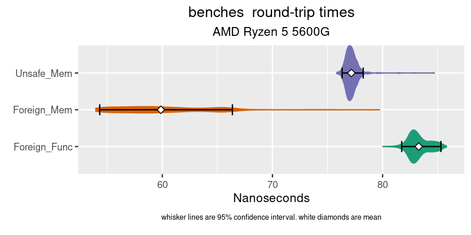

# Bench marks for Java's new foreign functions (and memory)

I wanted to do a quick micro-benchmark comparing Java's new foreign function/memory incubating project with clasic `UNSAFE` and `JNA`

The results:

The JNA code was around 700 nanos. It's not on this graph as it would dominate the intresting results.

At least on this machine, the new foreign memory is faster than `UNSAFE`, and the foreign call & return costs about 25 nanoseconds. Not bad.

## details

The timing benchmark is written in rust, and uses the fantastic criterion benchmarking framework. The benchmark times how long it takes another process to respond to a change in shared memory. It writes a value to location 1, then times how long before that same value is reflected in location 2.

The code under test spins on location 1 to change, and writes the value to location 2. In the case of the foreign function code, both the spinning on location 1, and the writing of the value two location 2 are done in a simple ZIG library (it looks like C from java's POV). In the case of JNA, it's how long JNA takes to call the same ZIG code as the foreign function.

I used the open JDK's Java-18 for all tests.

All caveats apply, including the questionable usefulness of micro-benchmarks when working with an actual code-base.
